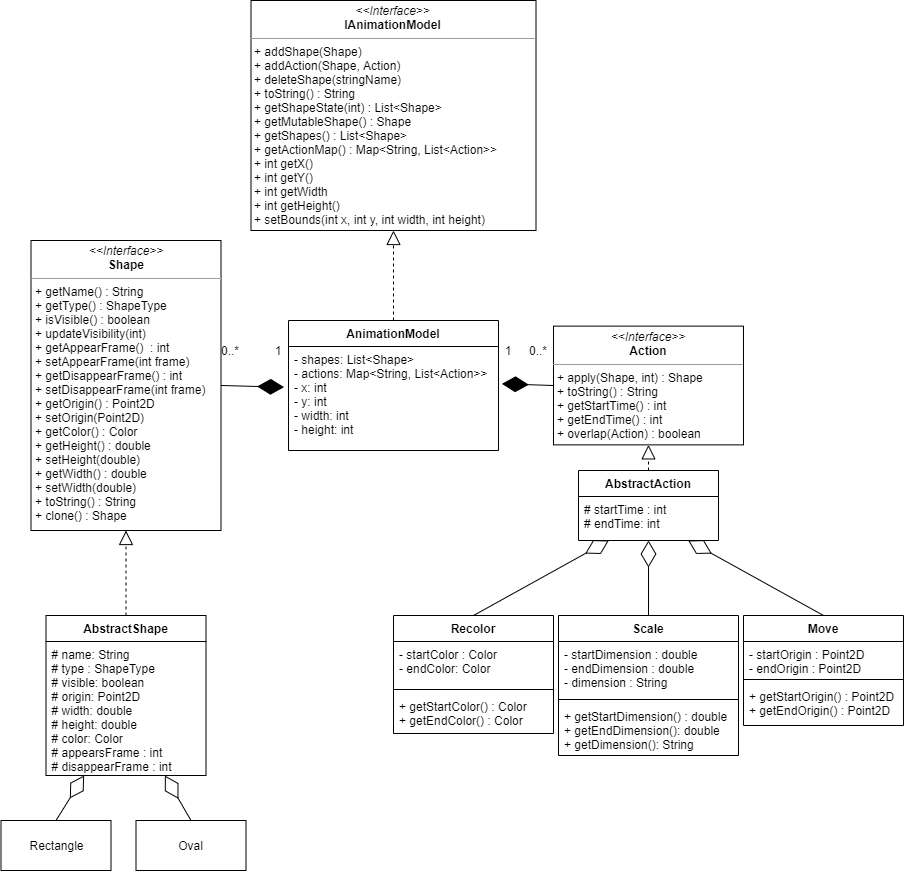

# EasyAnimator (Model and View)

Build animations with text descriptions using the Model-View-(Controller coming soon) design scheme.

# View Implementation

To simplify the process of using a view factory, each view implements the same `View` interface. As each view uses the model state differently, some methods in each view are left unimplemented, and calls to those unimplemented methods results in no actions or side effects. While this violates the _Interface Segregation_ principle of _SOLID_ OOD, it was a trade-off we were willing to make to allow for flexibility when using the view factory, in the name of the _Liskov Substitution Principle_ (a sub-interface would require different initialized method calls, and ideally each view can be constructed with the exact same procedure).

The critical functionality of each view is housed in its `render` method, which either writes to the given `Appendable` output or paints to its own frame. All other methods get or set the state of the model that is to be rendered.

### Text View

`TextView` requires two states: a `List<Shape>` and a `Map<String, List<Action>>`. Therefore, it is agnostic to our Model implementation, as long as the model can provide those two pieces of state. `TextView` appends its output to the given `Appendable` output object. Each `Shape` in the shape list is converted to a `String` that represents its state, next each `Shape`s `appearFrame` and `disappearFrame` is formatted into a `String`, and finally all `Action`s in the action map are congregated into a list (with `ActionWrapper`), sorted by their `startTime`, and formatted with their corresponding `Shape` object as a `String`.

### SwingView

`SwingView` makes use of the `javax.swing` library. Unlike `TextView`, it makes use only of a `List<Shape>` state, and implements no storage of `Action`s. Instead, `SwingView` is controlled by a pseudo-controller in the entry point of our currently controller-less application, that passes the correct state information and times calls to the `render` method to "play" the frames at the given `speed` (frames-per-second). This functionality was written in the main entry point instead of inside the view, as it is not the view's responsibility to get state from the model, it should only be passed state. The `getShapeState(int frame)` method on our `IAnimationModel` interface performs all tweening operations internally to the model, providing for easier implementation of new `Action`s, as `SwingView` cares not how they are implemented.

### SVGView

`SVGView` cannot be agnostic to how each `Action` is implemented, as `SwingView` is, because each `Action` (and `Shape`) must be translated into SVG elements. While this could be implemented inside the model as a `getSVG()` `Shape`/`Action` method, this modification would violate the _Single Responsibility_ principle. Instead, we delegated the task of translating `Shape`s and their related `Action`s to `OvalConverter` and `RectangleConverter`, which translate their respective `Shape`s and associated `Action`s into SVG formatted XML. This requires casting each `Action` to its respective class, in order to access its starting and ending state (which differ in type between `Action`s). While this implementation required adding getters to the model, those still fall under its responsibility of "hold and provide state". Adding further `Shape` sub-types to the model would require adding a new `ShapeConverter` for that shape type, whereas adding a new `Action` would require updating each defined `ShapeConverter` to handle that action-shape pair. As the `convert` method is the same for all `Shape` types, each convert inherits that method from `AbstractShapeConverter`.

# Model changes

### IAnimationModel

`AnimationModel` now has `x`, `y`, `width`, and `height`, that relate to the size and origin point of the animations canvas. The `Shape`s that make up an animation should be scaled by the animation's origin point. The relevant `getters` and `setters` have also been added (`setBounds` for all the new fields).

New functions added: `getMutableShape(String shapeName)`, `getShapes()`, and `getActionMap()`.

- `getMutableShape(String shapeName)` returns a mutable `Shape` object with the given `shapeName`. As `Shape`s are defined in the demo texts without state (`width`, `height`, etc). Those `Shape`s state needs to be accessible and mutable by the `AnimationBuilder` implementation.
- `getShapes()` returns the list of `Shape`s in the model as they are instantiated (at `frame=0`). Needed when supplying the views with state to represent.
- `getActionmap()` returns a `Map<String, List<Action>>` of shape names to their associated actions. Necessary when supplying the SVG and text views with state to represent.

### Shapes

Shapes now have an `appearFrame` and `disappearFrame`, as opposed to having related `Disappear` and `Appear` actions. While appearing and disappearing could conceptually be actions, `TextView` and `AnimationBuilder` treated `Shapes` as more tightly coupled with their appear/disappear frames, and we took the opportunity to make accessing a `Shapes` appear and disappear times more convenient. The relevant `getters` and `setters` were also added.

A `setVisible` method was added to the `Shape` interface, to allow for cloning into `Shape`s `visible` field value.

### Actions

Actions now have `getEndTime()` and `getStartTime()` methods, to provide for the ability to sort `List<Action>`s by their `startTime` and test for `overlap`. `Action`s also have an added `overlap` method, to test if it and another action overlap i.e. are and same type and apply over the same time period.

Each of the actions `Move`, `Recolor` and `Scale` have added fields for the starting state of the action: `startOrigin`, `startColor`, and `startDimension` respectively. Actions were previously not defined with starting state, and instead inferred the ability to "start anywhere, come here". This disagreed with the implementations of the Text and SVG views, as they require information on the starting state of each action. While this could have been inferred by previous actions on a shape, the overhead was larger than simply including the starting state on the action. Accordingly, each action has its own `get` methods for its starting and ending state. This is necessary for building the SVG view, as the Text view makes use of each actions `toString` method. The Text view implementation could (and probably should, eventually) implement its own translation of `Shape`s and `Action`s into `String`s.

# Model Design v1 (kept for posterity)

Animations are a collection of shapes and associated actions, displayed over a series of frames, shown consecutively at a certain time interval.

An animation has a List of `Shape`s and a corresponding HashMap of `shapeName -> List<Action>` pairs. `Shape`s and `Action`s are added via the `addShape` and `addAction` functions. Individual frames of the animation are represented as `List`s of `Shape`s, whose internal state represents the `Shape` at the given time. This functionality is encoded in the `getShapeState` function on the `IAnimationModel` interface. The original `Shape`s state is never mutated, rather copies of the `Shape` objects are mutated by the corresponding `Action` objects to update their state to reflect the state at that time (before/during/after `Actions` are taken).

We created three interfaces: `IAnimationalModel`, `Shape` and `Action` to allow us to create this animation.

An animation has:

    - shapes
    - actions

A shape has:

    - Name
    - Type
    - Start location
    - Width
    - Height
    - Color

An action has (depending on its specific implementation):
 
    - a starting frame number
    - an ending frame number
    - any one or none of: 
        * starting dimension and ending dimension
        * ending Color
        * ending Position

Classes `Rectangle` and `Oval` are the instances of the AbstractShape class. And classes `Appear`, `Disappear`, `Recolor`, `Scale` and `Move` are instances of `AbstractAction` class. By writing these classes, we allowed users to add new shapes or action commands following the same pattern without modifying existing code. 

## UML

